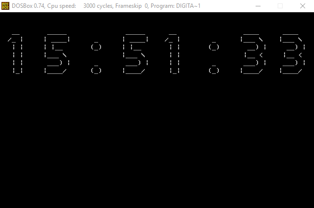

# Digital Clock 8086

> 中山大学计算机组成原理实验作业

## Introduction

This is a program simulating digital clock on emu8086 using 8086 Assembly.

## Folder Structure

```
.
├── bin         # Executable files
├── src         # Source files
├── tools       # Some tools
├── report.md   # Laboratory report
└── ...
```

## Build Setup

### Install DOSBox

[DOSBox](https://en.wikipedia.org/wiki/DOSBox) is an emulator program which emulates an IBM PC compatible computer running a DOS operating system.

We can download the DOSBox application from [https://www.dosbox.com/download.php?main=1](https://www.dosbox.com/download.php?main=1). Besides, you can download it from `tools/` (Only for Windows).

### Install emu8086

We need emu8086 to compile assembly code to executable file. You can download it from `tools/` (Only for Windows).

### Run

```bash
# Mount the folder which has clock.exe
mount c path/to/the/program

# Enter the folder
c:

# Run the program
clock.exe

# Press any key to exit the program
```

## Preview


